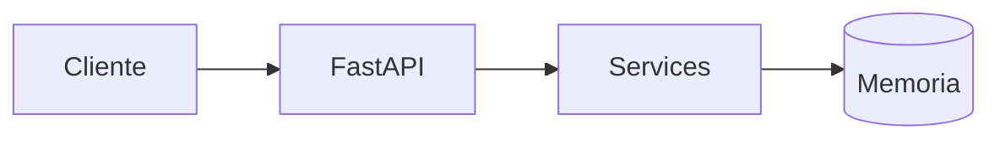
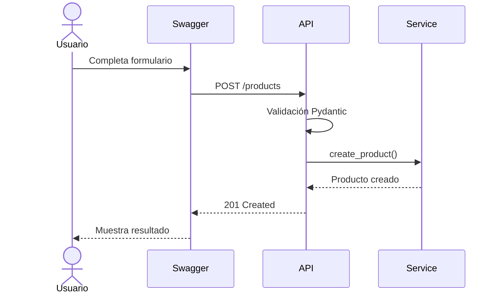
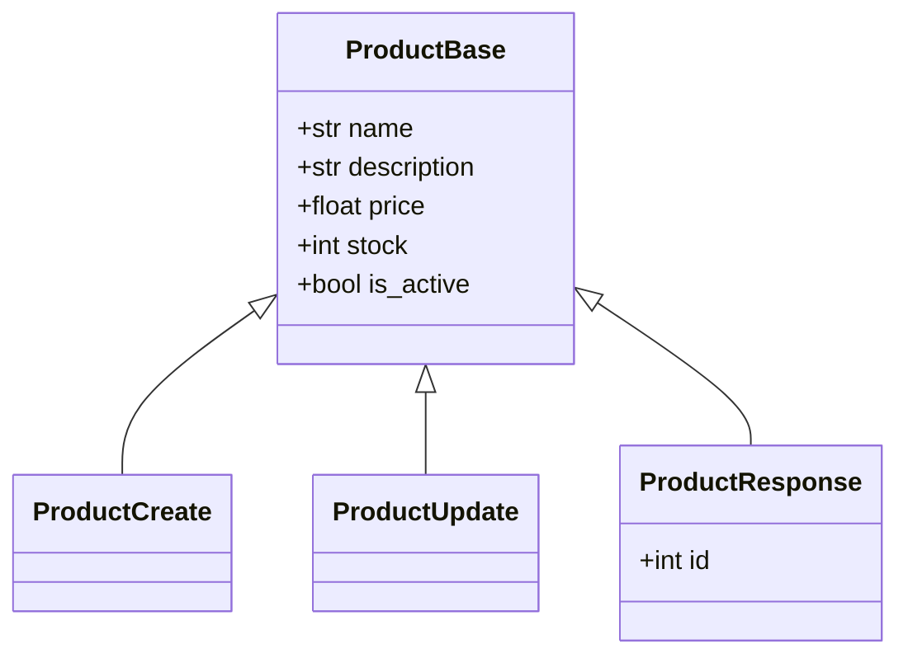
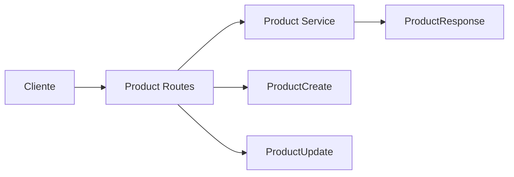
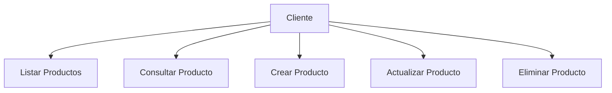

# API de Control de Inventario con FastAPI

## Descripción

En este ejercicio construiremos una API REST utilizando FastAPI para gestionar productos de inventario.

El objetivo es comprender:

* Cómo funciona una API REST.
* Cómo se estructuran los proyectos FastAPI.
* Cómo utilizar modelos Pydantic.
* Cómo validar datos de entrada.
* Cómo implementar operaciones CRUD básicas.
* Cómo almacenar información temporalmente en memoria.

> Importante:
>
> En esta primera versión NO utilizaremos una base de datos. Los datos existirán únicamente mientras la aplicación esté ejecutándose.

---

# Objetivos del Ejercicio

Al finalizar este ejercicio serás capaz de:

* Crear endpoints REST.
* Utilizar modelos Pydantic.
* Implementar validaciones.
* Utilizar Swagger UI.
* Comprender la separación de responsabilidades dentro de una API.
* Aplicar una estructura profesional de proyecto.

---

# Arquitectura General



---

# Flujo de una Petición



---

# Estructura del Proyecto

```text
app/
│
├── main.py
│
├── core/
│   └── config.py
│
├── models/
│   └── product.py
│
├── routes/
│   └── product_routes.py
│
├── services/
│   └── product_service.py
│
└── utils/
    └── helpers.py
```

---

# Responsabilidad de Cada Carpeta

## core

Contiene configuraciones generales de la aplicación.

Ejemplos:

* Variables de entorno
* Configuración global
* Constantes

---

## models

Contiene los modelos Pydantic.

Ejemplos:

```python
ProductCreate
ProductUpdate
ProductResponse
```

---

## routes

Define los endpoints de la API.

Ejemplos:

```python
GET /products
POST /products
```

---

## services

Contiene la lógica de negocio.

Ejemplos:

* Crear productos
* Buscar productos
* Actualizar productos
* Eliminar productos

---

## utils

Funciones auxiliares reutilizables.

Ejemplos:

* Formateo
* Conversión de datos
* Validaciones compartidas

---

# Modelo de Dominio

## Producto

Cada producto tendrá la siguiente información:

| Campo       | Tipo  |
| ----------- | ----- |
| id          | int   |
| name        | str   |
| description | str   |
| price       | float |
| stock       | int   |
| is_active   | bool  |

---

# Diagrama de Clases



---

# Arquitectura Interna



---

# Endpoints a Implementar

## Health Check

### GET /

Retorna el estado de la aplicación.

Respuesta:

```json
{
  "status": "ok",
  "message": "Inventory API is running"
}
```

---

## Obtener Productos

### GET /products

Retorna todos los productos registrados.

---

## Obtener Producto por ID

### GET /products/{product_id}

Ejemplo:

```http
GET /products/1
```

---

## Crear Producto

### POST /products

Body:

```json
{
  "name": "Teclado Mecánico",
  "description": "Teclado RGB para oficina y gaming",
  "price": 45.99,
  "stock": 10,
  "is_active": true
}
```

---

## Actualizar Producto

### PUT /products/{product_id}

Ejemplo:

```http
PUT /products/1
```

---

## Eliminar Producto

### DELETE /products/{product_id}

Ejemplo:

```http
DELETE /products/1
```

---

# Validaciones Requeridas

## Nombre

* Obligatorio
* Mínimo 3 caracteres
* Máximo 80 caracteres

---

## Descripción

* Obligatoria
* Mínimo 5 caracteres
* Máximo 200 caracteres

---

## Precio

* Obligatorio
* Mayor que cero

---

## Stock

* Obligatorio
* No puede ser negativo

---

# Ejemplo de Datos en Memoria

```python
products = [
    {
        "id": 1,
        "name": "Teclado Mecánico",
        "description": "Teclado RGB",
        "price": 45.99,
        "stock": 10,
        "is_active": True
    }
]
```

---

# Flujo CRUD



---

# Ejecución del Proyecto

Crear entorno virtual:

```bash
uv init
```

Activar entorno virtual:

Windows:

```powershell
.venv\Scripts\activate
```

Linux / Mac:

```bash
source .venv/bin/activate
```

Instalar dependencias:

```bash
uv sync
```

Ejecutar aplicación:

```bash
uvicorn app.main:app --reload
```

---

# Documentación Automática

FastAPI genera documentación automáticamente.

Swagger UI:

```text
http://localhost:8000/docs
```

ReDoc:

```text
http://localhost:8000/redoc
```